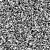
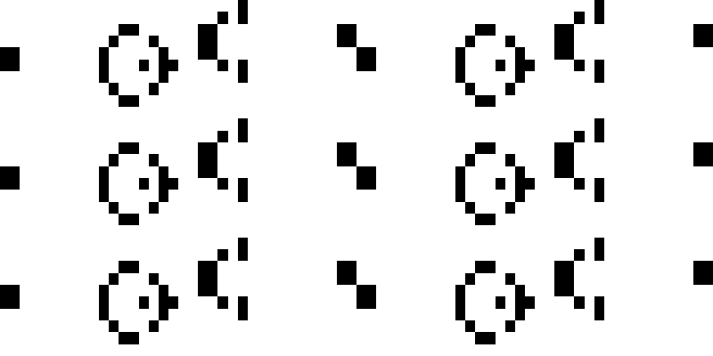

# congolway
[](https://travis-ci.org/diegojromerolopez/congolway)
[](https://goreportcard.com/report/github.com/diegojromerolopez/congolway)
[](https://codeclimate.com/github/diegojromerolopez/congolway/maintainability)
[](https://codeclimate.com/github/diegojromerolopez/congolway/test_coverage)
[](http://hits.dwyl.com/diegojromerolopez/congolway)


[Conway's Game of Life](https://en.wikipedia.org/wiki/Conway%27s_Game_of_Life) gif and apng generator in Go.

I wanted to make some kind of portmanteau between Conway and Game of Life.
Hence **congolway**.

## Features
* Parallel next generation implementation.
* Show Game of Life in terminal.
* Sparse-matrix based storage.
* Storing instances of Game of Life in text files.
* Generation of GIF and APNG animations for your game of life instances.
* Tested and developed following the advice of Go community.
* Support for Plaintext files, i.e. [.cells files](https://www.conwaylife.com/wiki/Plaintext).


## Construction
Use makefile to create executables in bin directory:

```sh
make build
```

## Usage

### Stdout output
Shows the game of life in your Linux/MacOS terminal.
```sh
Usage of ./bin/golstdout:
  -delay int
        Delay between frames, in milliseconds (default 500)
  -generations int
        Number of generations of the cellular automaton (default 100)
  -inputFilePath string
        File path of the Congolway (.txt) or cells (.cells) file
  -procs int
        Number of GO processes used to compute generations. By default is -1 (use as many as hardware CPUs), enter a positive integer to set a custom number of proceses (default -1)
```

### APNG generator
Creates a [APNG](https://en.wikipedia.org/wiki/APNG) animation of the Game of Life.
```sh
Usage of ./bin/golapng:
  -generations int
        Number of generations of the cellular automaton (default 100)
  -inputFilePath string
        File path of the Congolway (.txt) or cells (.cells) file
  -outputFilePath string
        File path where the output apng will be saved (default "out.apng")
  -procs int
        Number of GO processes used to compute generations. By default is -1 (use as many as hardware CPUs), enter a positive integer to set a custom number of proceses (default -1)
```

### GIF generator
Creates a [GIF](https://en.wikipedia.org/wiki/GIF) animation of the Game of Life.
```sh
Usage of ./bin/golgif:
  -delay int
        Delay between frames, in 100ths of a second (default 5)
  -generations int
        Number of generations of the cellular automaton (default 100)
  -inputFilePath string
        File path of the Congolway (.txt) or cells (.cells) file
  -outputFilePath string
        File path where the output gif will be saved (default "out.gif")
  -outputHeight int
        Height of the output gif image. If -1, this image will not be scaled (default -1)
  -outputWitdh int
        Width of the output gif image. If -1, this image will not be scaled (default -1)
  -procs int
        Number of GO processes used to compute generations. By default is -1 (use as many as hardware CPUs), enter a positive integer to set a custom number of proceses (default -1)
```

### SVG generator
Creates a [SVG](https://en.wikipedia.org/wiki/Scalable_Vector_Graphics) animation of the Game of Life.

**NOTE: this tool is in a highly-unstable state and generates extremly heavyweight SVGs.
I'm in process of optimizing it. Use it at your own risk.**

```sh
Usage of ./bin/golsvg:
  -delay int
        Delay between frames, in 100ths of a second (default 1)
  -generations int
        Number of generations of the cellular automaton (default 100)
  -inputFilePath string
        File path of the Congolway (.txt) or cells (.cells) file
  -outputFilePath string
        File path where the output gif will be saved (default "out.svg")
  -procs int
        Number of GO processes used to compute generations. By default is -1 (use as many as hardware CPUs), enter a positive integer to set a custom number of proceses (default -1)
```

### Random grid generator
Creates a txt file ([see its format](/doc/congolway_file_format.md)) with an (uniformly) random grid.
```sh
Usage of ./bin/randomgol:
  -columns int
        Number of columns of the grid (default 100)
  -description string
        Description of the game of life instance that will be created
  -name string
        Name of the game of life instance that will be created (default "Random Gol")
  -outputFilePath string
        File path where the random grid will be saved (only .txt and .cells extensions are allowed) (default "out.txt")
  -outputFormat string
        Only used for congolway files (.txt files). File format "dense" or "sparse"
  -randomSeed int
        Random seed
  -rows int
        Number of rows of the grid (default 100)
```

## Spawner
This program fast forwards a number of generations and saves
the game of life instance in a file.
```sh
Usage of ./bin/golspawner:
  -generations int
        Number of generations of the cellular automaton (default 100)
  -inputFilePath string
        File path of the Congolway (.txt) or cells (.cells) file
  -outputFilePath string
        File path where the output .txt will be saved (default "out.txt")
  -procs int
        Number of GO processes used to compute generations. By default is -1 (use as many as hardware CPUs), enter a positive integer to set a custom number of proceses (default -1)
```

## Samples

Using the file [samples/grid100x100.txt](samples/grid100x100.txt):

### 100x100 gif animation
```sh
./bin/golgif -inputFilePath="./samples/grid100x100.txt" -outputFilePath="./samples/grid100x100.gif"
```



### Gosper Glider Gun gif animation
```sh
 ./bin/golgif -inputFilePath="./samples/gosper_glider_gun.txt" -outputFilePath="./samples/ggg.gif" \
      -outputWitdh=800 -outputHeight=400 -generations=50
```



### 100x100 apng animation
```sh
./bin/golgif -inputFilePath="./samples/grid100x100.txt" -outputFilePath="./samples/grid100x100.apng"
```


## TODO
* ~~Read a game of life from a gif/png still image.~~
* Make a CellsStorer implementation based on file system.
* Make a distributed CellsStorer implementation.
* Ability to load programs in a game of life. Programs
Are a sequence of cell changes indexed by generation.
There is also the posibility to have conditional cell changes.
* Desktop app to run a program in a game of life instance:
  * Sync (load programs before start)
  * Async (allow the user to interact with the gol with the mouse)
* Implement a ncurses game of life animation.
* Implement a multiplatform desktop app.
* Implement neighborhood functions.
* ~~Include gliders and other patterns.~~
* ~~Implement Grid as a sparse matrix.~~ Done by using the [thread-safe](https://golang.org/pkg/sync/#Map) [dictionary of keys](https://en.wikipedia.org/wiki/Sparse_matrix#Dictionary_of_keys_(DOK)) sparse matrix pattern.
* Implement some kind of application (maybe a Turing machine?) in a Game of Life instance.
* ~~Different neighborhood types.~~
* ~~Infinite grids by horizontal or vertical directions.~~
* ~~Encode APNG.~~
* ~~Define a new format that is more compact (based on sparse matrix). Allow outputting in this format.~~
* Read the following formats:
  * ~~[Plaintext](https://www.conwaylife.com/wiki/Plaintext)~~
  * [Life 1.05](https://www.conwaylife.com/wiki/Life_1.05), i.e. .lif or .life files.
  * [Life 1.06](https://www.conwaylife.com/wiki/Life_1.06), i.e. .lif or .life files.
  * [Other formats](http://psoup.math.wisc.edu/mcell/ca_files_formats.html)
* ~~Allow definition of multiple rules of spawning.~~ Done based on [Life 1.05](https://www.conwaylife.com/wiki/Life_1.05) rules format.
* ~~Allow cells with more states.~~ In case there is more states, allow definition of custom rules.
* ~~Continous integration.~~
* Read zipped files. *Is it really needed, though?*
* Allow extracting size from grid. *Is it really needed, though?*
* ~~Parallelize.~~

* ~~Scaling of gif animations.~~
* Serve in a http server.

## Code of Conduct
Everyone interacting in the Congolway project’s codebases, issue trackers,
chat rooms and mailing lists is expected to follow the [code of conduct](/CODE_OF_CONDUCT.md).

## Contributions
I accept contribution and feature requests via PR (GitHub pull requests).

Create an issue or send me an email before making a PR if you are unsure
about if your PR is going to be accepted.

Any suggestion, issue or constructive criticism is also welcomed.

## License
[MIT](LICENSE)
